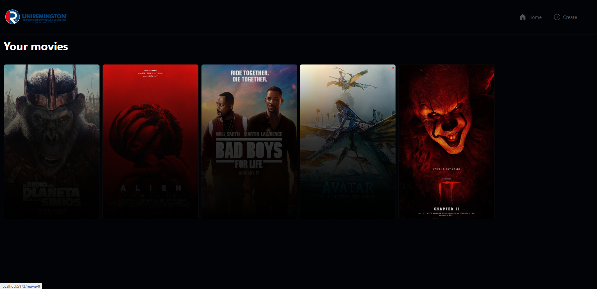
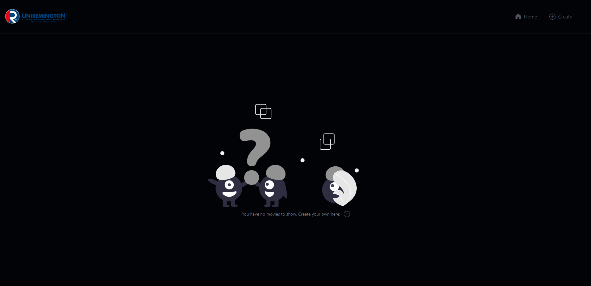
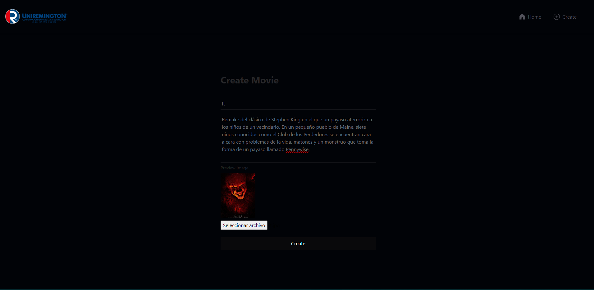
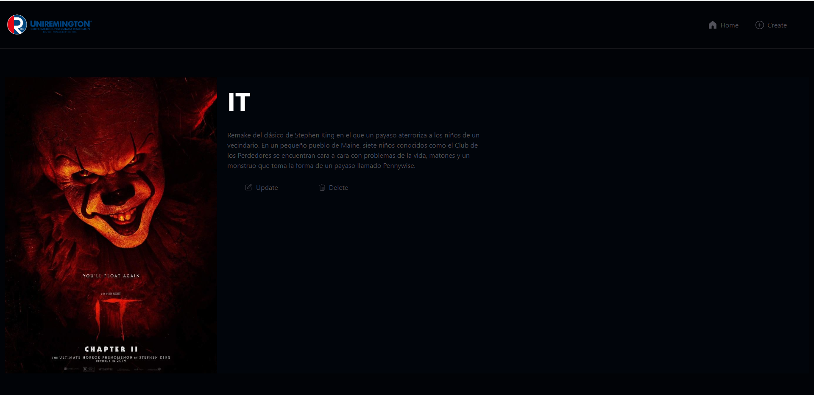
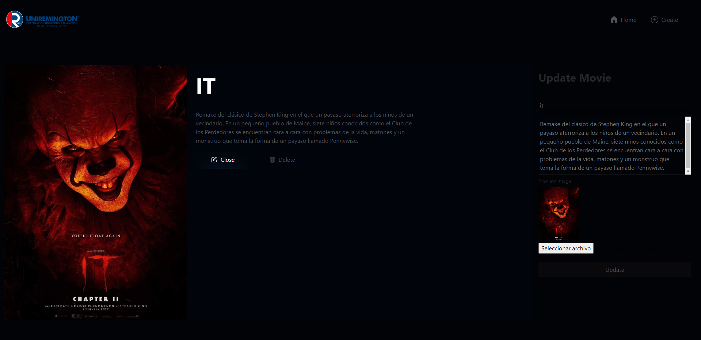
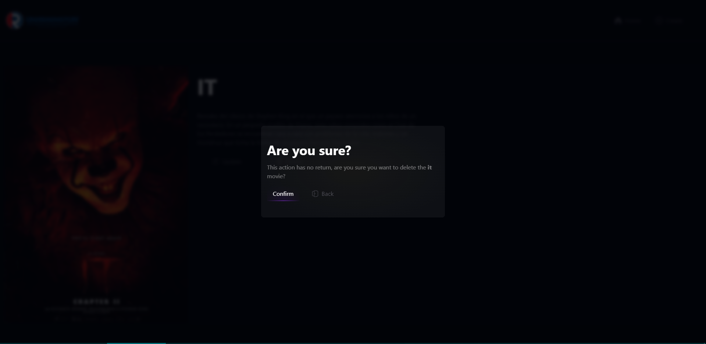

# Trabajo de Universidad: Remington

Se realiza un CRUD para la gestión y creación de películas utilizando los lenguajes de programación Javascript con el framework de React JS y Python con el framework de Django y un gestor de base de datos MySql con la herramienta de administración WorkBench.

### Estructura Básica Proyecto

```text
/
client
├── public/
│   └── logo-universidad.png
├── src/
│   ├── components/
│   │   └── Componentes de React js
│   ├── hooks/
│   │   └── Custom Hooks
│   ├── pages/
│   │    └── Páginas a utilizar
│   ├── App.jsx
│   ├── config.js
│   ├── helpers.js
└── package.json
movies
├── Archivos necesarios para el guardado y lectura de la aplicación en Django
movies_api
├── Archivos de configuración del proyecto en Django
manage.py
requirements.txt
```

### Página Web



## Instalación

Para ser uso de este repositorio se recomienda tener instalado Node js y Python

| -       | Versión  |
| ------- | -------- |
| Node js | v20.11.1 |
| Python  | v3.12.5  |

> [!TIP]
> Antes de clonar el repositorio crea un entorno virtual de python con el siguiente comando

```
python -m venv [nombre_del_entorno]
```

Una vez creado el entorno virtual seleccionalo y asegurate que lo estes utilizando, una vez creado y asegurado que lo estas utilizando sigue los siguientes pasos

#### Pasos a seguir

```
git clone https://github.com/Crisops/CRUD-REMINGTON.git
```

Abrimos Visual Studio Code y en la terminal integrada creamos **dos** terminales:

1. **Primer terminal**: Ejecutara el servidor del Backend
2. **Segunda Terminal**: Ejecutara el servidor local para el Frontend

## Instalar dependencias

1. En la raiz del proyecto abrimos la **primer** terminal y escribimos el siguiente comando:

```
pip install -r requirements.txt
```

2. En la raíz del proyecto abrimos la **segunda** terminal y escribiremos los siguientes comandos

```
cd client
```

```
npm install
```

## Variables de Entorno

Para correr este projecto, tu necesitas añadir las siguientes variables de entorno en tu archivo `.env`

`DB_NAME` `DB_HOST` `DB_PORT` `DB_USER` `DB_PASSWORD`

> [!WARNING]
> En la carpeta `movies_api` en el archivo `settings.py` cambia las credenciales por las tuyas y el puerto de dominio en `CORS_ALLOWED_ORIGINS` el cual acepta las peticiones del Frontend en caso de que sea distino al "5173".

```
DATABASES = {
    'default': {
        'ENGINE': 'django.db.backends.mysql',
        'NAME': os.getenv('DB_NAME'),
        'HOST': os.getenv('DB_HOST'),
        'PORT': os.getenv('DB_PORT'),
        'USER': 'os.getenv('DB_USER'),
        'PASSWORD': os.getenv('DB_PASSWORD'),
    }
}

CORS_ALLOWED_ORIGINS = [
    "http://localhost:5173,
]

```

# Levantar servidores

1. Primera terminal

```
python manage.py runserver
```

2. Segunda Terminal

```
npm run dev
```

# PÁGINA WEB

### Inicio página Web



### Crear una película



### Visualización de películas


### Película seleccionada



### Actualizar una película



### Eliminar una Película


